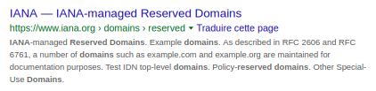

Les <abbr title="Unified Resource Locator">URL</abbr>, plus courrament appelés *adresses*, vous connaissez ?
Ce sont ces chaînes de caractères comme celle-là : <https://googhell.fr/bourdes/002-google-supprime-des-applications-appstore-donation/>.
C'est ce qui apparait tout en haut de votre navigateur.
Vous pouvez la copier, la partager, que ce soit une page web, une image, une vidéo...
C'est long, pas très joli, mais ça fait son taf.

Figurez-vous que *Google n'aime pas trop cette chose-là, et cherche à la cacher, à plusieurs reprises*.
Déjà dans leur fameux moteur de recherche, en supprimant une partie et en remplaçant les `/` par des `>`.

Et ça a été testé plusieurs fois [^1] dans leur navigateur Chrome, en conservant uniquement le nom de domaine, comme ceci :

[^1]: Ça a été implémenté globalement dans Chrome 69 (Septembre 2018), puis testé pour une poignée d'utilisateurs dans Chrome 76 (Juillet 2019), mais ça a été remis normalement peu de temps après.

---

Pourquoi cela peut-il être un souci me demanderez-vous ?
Après tout, s'ils sacrifient le côté pratique de l'URL pour de l'esthétisme c'est leur problème non ?

À quoi je vous réponds : posez-vous la question suivante.
*Comment un internaute peut-il se rendre sur la page web que lui indique un ami/collègue/autre s'il ne peuvent pas échanger d'adresse ?*
En cherchant sur Google pardi !
Ce dernier se récupère alors un revenu grâce aux publicités postées au passage, et des données supplémentaires sur le comportement de l'internaute.

Une autre réponse à cette question pourrait être d'utiliser les fonctions de partage intégrées à la page ou au navigateur (notamment sur mobile).
Mais cela n'est guère mieux pour l'utilisateur (même si ça ne bénéficie pas forcément à Google lui-même).
Les boutons de partage présents sur une page web sont très souvent pour faire des publications visibles par tous.
Et ceux intégrés au navigateur pourraient potentiellement être interceptés.

*La recherche n'est d'ailleurs pas une science exacte, et l'internaute ne tombera pas forcément sur la page que son interlocuteur aura sous les yeux*.
Rien n'empêche alors Google de pousser vers le haut de ses résultats des pages où il a intérêt que l'utilisateur aille.
Ou au contraire pousser vers le bas des pages qu'il n'apprécie guère (la présente par exemple !).

On peut déjà voir aujourd'hui une preuve de ce genre de favoritisme avec les pages AMP, qui apparaissent en haut des résultats de recherche.
AMP est un moyen aux journaux de rendre leurs articles en ligne disponible par l'intermédiaire de Google, pour soi-disant « améliorer les performances ».
Et comme les URL sont cachées et remplacées par celle du journal, *il n'y a aucun moyen visuel simple de savoir que la connexion passe en réalité par le géant* !

On pourrait aussi dire que supprimer les URL est une mauvaise idée car ça peut *favoriser le hameçonnage*.
Mais ce n'est pas pertinent : une minorité de personne utilisent l'URL pour vérifier si une page web est légitime ou non.
L'équipe derrière Chrome en apporte d'ailleurs les preuves [^2].
C'est une justification nécessaire, cependant pas suffisante pour cacher les URLs.

[^2]: <https://twitter.com/estark37/status/1191473763172278272>

---

Le partage par URL reste toujours disponible, et les internautes technophiles pourront toujours éviter/faire éviter les désagréments précédemment cités.
Mais pour le reste –majoritaire– des internautes, cette possibilité sera encore moins utilisée puisque cachée.
Et *Google se rendra encore plus indispensable pour naviguer sur le web*.

